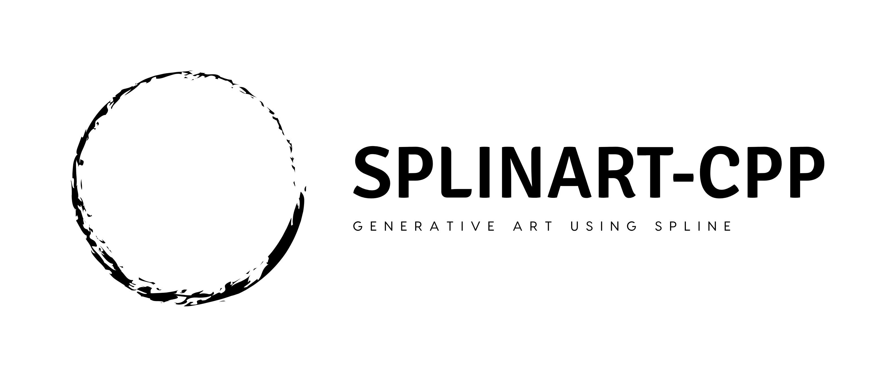
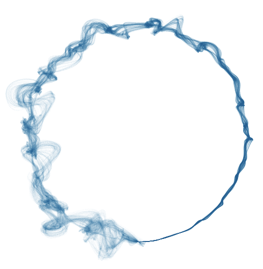

<!-- Improved compatibility of back to top link: See: https://github.com/gouarin/splinart-cpp/pull/73 -->
<a name="readme-top"></a>
<!--
*** Thanks for checking out the Best-README-Template. If you have a suggestion
*** that would make this better, please fork the repo and create a pull request
*** or simply open an issue with the tag "enhancement".
*** Don't forget to give the project a star!
*** Thanks again! Now go create something AMAZING! :D
-->


<!-- PROJECT SHIELDS -->
<!--
*** I'm using markdown "reference style" links for readability.
*** Reference links are enclosed in brackets [ ] instead of parentheses ( ).
*** See the bottom of this document for the declaration of the reference variables
*** for contributors-url, forks-url, etc. This is an optional, concise syntax you may use.
*** https://www.markdownguide.org/basic-syntax/#reference-style-links
-->
[![Contributors][contributors-shield]][contributors-url]
[![Stargazers][stars-shield]][stars-url]
[![Issues][issues-shield]][issues-url]
[![MIT License][license-shield]][license-url]

<!-- PROJECT LOGO -->
<br />
<div align="center">
  <a href="https://github.com/gouarin/splinart-cpp">
    <picture>
        <source media="(prefers-color-scheme: dark)" height="200" srcset="./doc/source/logo/dark_logo.png">
        
    </picture>
  </a>

  <p align="center">
A project to illustrate the use of development tools and their automation with GitHub Actions
    <br />
    <a href="https://gouarin.github.io/splinart-cpp"><strong>Explore the docs »</strong></a>
    <br />
    <br />
    <a href="https://github.com/gouarin/splinart-cpp/issues">Report Bug</a>
    ·
    <a href="https://github.com/gouarin/splinart-cpp/issues">Request Feature</a>
  </p>
</div>


<!-- TABLE OF CONTENTS -->
<details>
  <summary>Table of Contents</summary>
  <ol>
    <li>
      <a href="#about-the-project">About The Project</a>
    </li>
    <li>
      <a href="#getting-started">Getting Started</a>
      <ul>
        <li><a href="#prerequisites">Prerequisites</a></li>
        <li><a href="#installation">Installation</a></li>
      </ul>
    </li>
    <li><a href="#usage">Usage</a></li>
    <li><a href="#contributing">Contributing</a></li>
    <li><a href="#license">License</a></li>
    <li><a href="#contact">Contact</a></li>
    <li><a href="#acknowledgments">Acknowledgments</a></li>
  </ol>
</details>


<!-- ABOUT THE PROJECT -->
## About The Project

The development of open-source software for numerical simulation is becoming an increasingly important part of the research process. It enables numerical methods to be validated, new algorithms to be developed and methods to be appropriated and enriched by anyone. Opening up our research codes is also part of the open science approach, and it's not a question of "just" putting an archive with the sources on a web page.

The philosophy and structure of a piece of software emanate from its precursors and evolve as different contributions are made. However, to ensure that this architecture does not collapse at the slightest change, a framework is necessary. Setting up such a framework is a constraint. It's a question of supporting contributors in these new practices and finding the compromise between a restrictive framework and giving free rein to creativity.

During the development process, many tasks are repetitive and can be the source of errors or application regressions. These include unit testing, code formatting, errors that may be revealed during static analysis, documentation generation and the creation of new versions when the application is distributed via packaging systems (pypi, conda, vcpkg, spack, nix, guix, etc.).

This directory is the end result of a workshop describing each of the tools that can greatly facilitate the development process and interaction with all the players involved in an open-source project. It also describes a development framework that is validated using GitHub Actions.

The workshop is here: https://github.com/gouarin/dev_env_and_automatisation

We're going to use a ready-to-use C++ code that creates generative art from the equation of a circle and splines. This program displays renderings of the following type

<div align="center">
  
</div>

The basic idea comes from [inconvergent](https://inconvergent.net/generative/sand-spline/) website.

<p align="right">(<a href="#readme-top">back to top</a>)</p>

<!-- GETTING STARTED -->
## Getting Started

### Prerequisites

If you want to try locally this project, you have to install [pixi](https://github.com/prefix-dev/pixi).

If you are on linux or macos
  ```bash
curl -fsSL https://pixi.sh/install.sh | bash
  ```

if you are on Windows

```powershell
iwr -useb https://pixi.sh/install.ps1 | iex
```


### Installation

### From source
1. Clone the repo
   ```sh
   git clone https://github.com/gouarin/splinart-cpp.git
   ```
3. Install the dependencies
   ```bash
   pixi install
   ```
4. Build and run
   ```bash
   pixi run start
   ```

### With conda

1. Create a new environment
   ```bash
   pixi init
   ```
2. Add `gouarin` channel in the `pixi.toml` file
3. Install `splinart-cpp`
   ```bash
   pixi add splinart-cpp
   ```
4. Run
   ```bash
   splinart-cpp
   ```

<p align="right">(<a href="#readme-top">back to top</a>)</p>

<!-- USAGE EXAMPLES -->
## Usage

Once the project is installed on your system, you have access to the splinart-cpp program. This has several options for modifying the final rendering.

- Print help
  ```bash
  splinart-cpp --help
  ```

- Choose the number of circles
  ```bash
  splinart-cpp --nb-circles 10
  ```

- Random colors
  ```bash
  splinart-cpp --random-color
  ```

<p align="right">(<a href="#readme-top">back to top</a>)</p>

<!-- CONTRIBUTING -->
## Contributing

First off, thanks for taking the time to contribute! Contributions are what make the open-source community such an amazing place to learn, inspire, and create. Any contributions you make will benefit everybody else and are **greatly appreciated**.


Please read [our contribution guidelines](./CONTRIBUTING.md), and thank you for being involved!

<p align="right">(<a href="#readme-top">back to top</a>)</p>


<!-- LICENSE -->
## License

Distributed under the MIT License. See `LICENSE.txt` for more information.

<p align="right">(<a href="#readme-top">back to top</a>)</p>


<!-- CONTACT -->
## Contact

Loic Gouarin - [@lgouarin](https://twitter.com/lgouarin) - loic.gouarin@gmail.com

Projects Link: [https://github.com/gouarin](https://github.com/gouarin)

<p align="right">(<a href="#readme-top">back to top</a>)</p>

<!-- MARKDOWN LINKS & IMAGES -->
<!-- https://www.markdownguide.org/basic-syntax/#reference-style-links -->
[contributors-shield]: https://img.shields.io/github/contributors/gouarin/splinart-cpp.svg?style=for-the-badge
[contributors-url]: https://github.com/gouarin/splinart-cpp/graphs/contributors
[stars-shield]: https://img.shields.io/github/stars/gouarin/splinart-cpp.svg?style=for-the-badge
[stars-url]: https://github.com/gouarin/splinart-cpp/stargazers
[issues-shield]: https://img.shields.io/github/issues/gouarin/splinart-cpp.svg?style=for-the-badge
[issues-url]: https://github.com/gouarin/splinart-cpp/issues
[license-shield]: https://img.shields.io/github/license/gouarin/splinart-cpp.svg?style=for-the-badge
[license-url]: https://github.com/gouarin/splinart-cpp/blob/readme/LICENSE.txt
[product-screenshot]: doc/images/splinart.png
